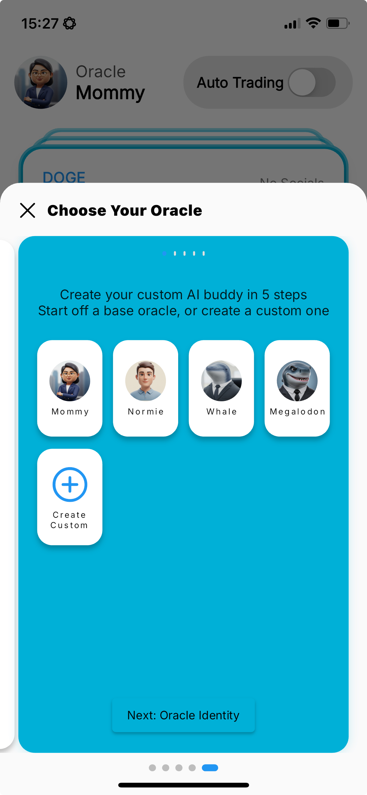
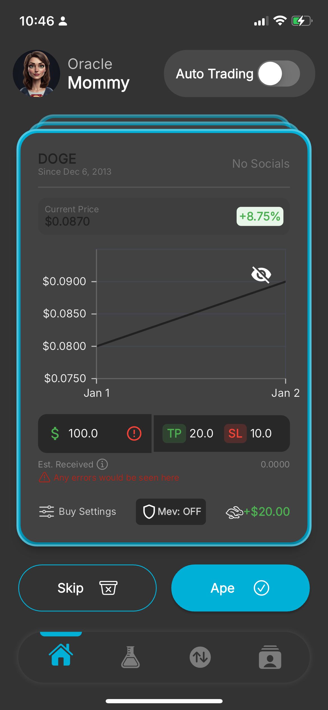
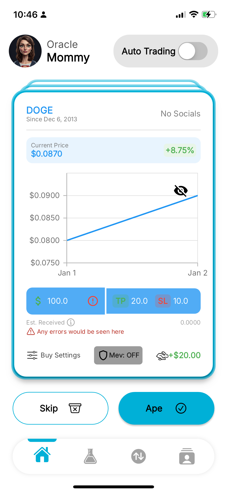
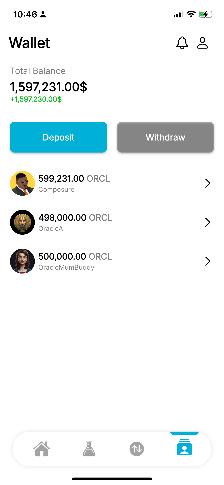
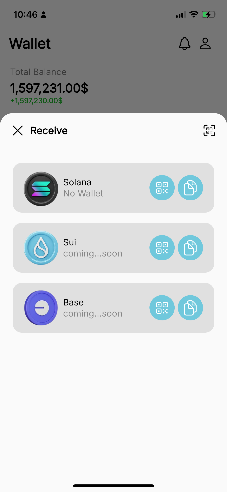
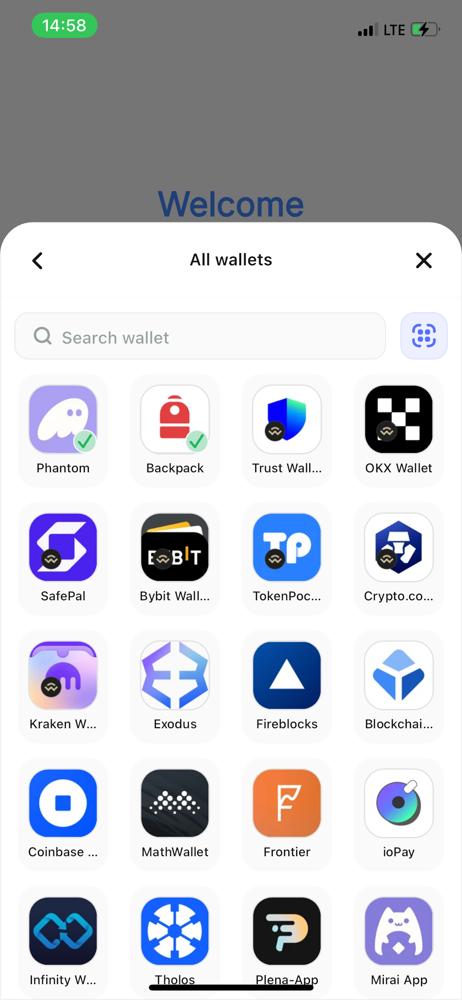
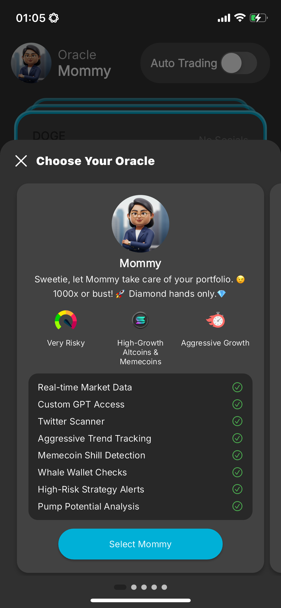
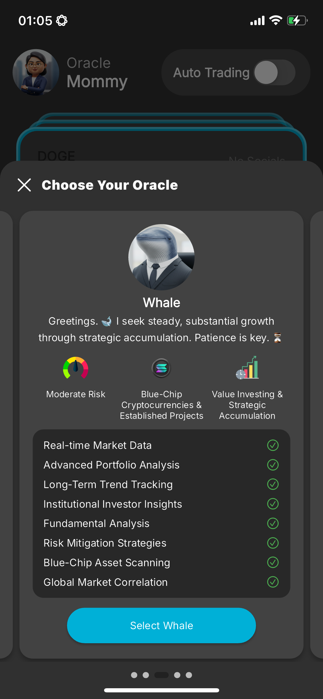

# Oracle Mobile Application

**Oracle** is an AI-powered memecoin trading app built on Solana, designed to simplify trading by offering intelligent coin suggestions and automated trading features. This app is built using Flutter and integrates with **Reown Wallet AppKit** for seamless wallet interactions on Solana.

**This project would be made PRIVATE after this bounty, until it has be AUDITED, then it would be OPEN SOURCE.**

Please go through this README properly to ensure to not miss out on any important details

## 📱 Live App Preview Steps

You can preview the app ios for a limited time with this link: [Mobile Prototype Live](https://appetize.io/app/b_5otgenbnwbjy643wamudlyibba) in case it does not work, it means the live preview has been used for more than 30 minutes and is no longer available. When you are connected:

- Click on start the device
- Or the app would open automatically
- You can use a wallet like backpack to sign in to the app to view the UI, but to test the jupiter functionality, you would need to run the app on a real ios device or android device as this would for signing which has to be done with a wallet, as this simulator does not have any installed wallet nor does it have abilities to have one legally.

## 🚀 Features

- AI-driven trading suggestions with TP (Take Profit) and SP (Stop Loss) automation.
- Customizable trading bots tailored to different risk profiles.
- Real-time coin discovery and filtering.
- Secure and seamless wallet integration with non-custodial wallets.
- Comprehensive position tracking with detailed trade history.

## 📷 Screenshots

Below are some screenshots of the Oracle mobile application. (Click to enlarge)

<table>
  <tr>
    <td></td>
    <td></td>
    <td></td>
  </tr>
  <tr>
    <td></td>
    <td></td>
    <td></td>
  </tr>
  <tr>
    <td></td>
    <td></td>
  </tr>
</table>

## 📂 Project Structure Overview

    oracle/
    ├── assets/
    ├── fonts/
    ├── lib/
    │   ├── main.dart
    │   ├── core/
    │       │── constants/
    │       │── extensions/
    │       │── helpers/
    │       │── theme/
    │       │── utils/
    │   ├── data/
    │       │── controllers/
    │       │── local/
    │       │── model_data/
    │       │── services/
    │   ├── presentation/
    │       │── general_components/
    │       │── views/
    │       │── splash.dart
    │   ├── utils/
            │── locator.dart
    ├── middleware/
    ├── pubspec.yaml
    ├── README.md
    ├── LICENSE

## 🎒 Prerequisites

- Flutter SDK (version 3.5.3 or higher)
- Dart SDK (version 3.5.3 or higher)
- Android Studio or Xcode (for emulator/simulator setup)
- Node.js (for dependency management)

## 🛠️ Setup & Installation

Follow these steps to set up and run the Flutter Frontend:

    git clone https://github.com/immadominion/oracle.git
    cd oracle/
    flutter pub get
    flutter run

Follow these steps to set up and run the Node Middleware:

    cd middleware/
    npm install
    node server.js

## 🔗 Important Links

- [Product Idea Showcase OR MVP Video](https://youtu.be/b0bwi08mNVg)
- [Executive Summary](https://docs.google.com/document/d/1KcQMZguvcuPNzFtR0baqZgaiQmMS2x_7QlaW-hgE4vc/edit?usp=sharing)
- [Product Overview](https://docs.google.com/document/d/173OEFf0oRkm4rxrnrVzsoU2qeTHfOcUbQQCLFIBgMyg/edit?usp=sharing)
- [User Story Document](https://docs.google.com/document/d/1FJII0YBEerA2OGUogrEJnKMOxCFB-rqi84evhH91m5k/edit?usp=sharing)
- [Business Ideation Document](https://docs.google.com/document/d/1Ifpv0AXsQ_1tDuNdO7TDHdcdbYQkJ4cLsqkEJK-p194/edit?usp=sharing)
- [Oracle Technical Document](https://docs.google.com/document/d/12hs-oIr8RbnLUBA645F--17bn61ET-5VQ1IVenSBMn0/edit?usp=sharing)
- [Landing Page UIUX Design Link](https://www.figma.com/design/Wp7Ye32C5VLOq9SQuq25K1/Oracle-AI-High-Fidelity?node-id=290-849&t=5JTKxU8rrcEqe8qJ-1)
- [Landing Page UIUX Preview Link](https://www.figma.com/proto/Wp7Ye32C5VLOq9SQuq25K1/Oracle-AI-High-Fidelity?node-id=101-79&p=f&t=AqGYEVSwNGZoBbvS-1&scaling=min-zoom&content-scaling=fixed&page-id=0%3A1)

## 📌 Roadmap

- ✅ MVP launch with core features.
- 🚧 Android optimization.
- 🔜 Multi-chain support i.e - Sui, Ton, Base, and Bnb.

## 📜 License

This project is currently not licenced at the moment, but would be in no distant with MIT and other standard open sources licenses.

## Acknowledgments

- Special thanks to the Solana community at SuperteamEarn(Formerly SuperteamDAO) for their platform, and Reown(Previously known as Wallet Connect) for hosting a bounty on their new Solana launch
- Thanks to the Flutter team for providing an excellent framework for cross-platform development.
- Thanks to the Appetize team for providing me with a platform to show my mobile applications to the world be official market readiness.
- Thanks to @Davejnr(SuperteamNG Owerri Devrel) for unwavering support during my build process

For any questions or issues, please open an issue on the [GitHub repository](https://github.com/Immadominion/Oracle).
